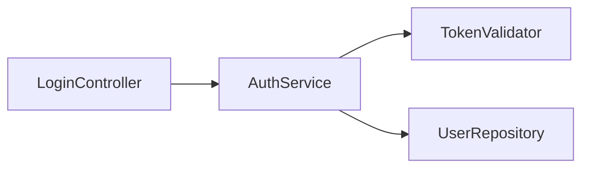

# Layer 2: 処理 (Processing)

> 読んだ情報をどう解釈・判断するか

## 2-1. インターフェイス解析

**チェックリスト**:

```
□ 入力: 何を受け取るか（引数、依存注入）
□ 出力: 何を返すか（戻り値、副作用）
□ 制約: 前提条件、不変条件、エラー条件
□ 責務: このコードは何を「約束」しているか
```

### 解析の実践例

```typescript
// このコードを解析する
export const createUser = async (
  input: CreateUserInput,
  repo: UserRepository
): Promise<Result<User, ValidationError | DuplicateError>> => { ... };
```

**解析結果**:
- 入力: `CreateUserInput`（データ）, `UserRepository`（依存注入）
- 出力: `Result<User, ...>`（成功/失敗を明示）
- 制約: バリデーションエラー、重複エラーの可能性
- 責務: ユーザー作成（永続化はrepoに委譲）

## 2-2. 関係性の把握

**3つの視点で分析**:

| 視点 | 問い | 可視化手法 |
|------|------|-----------|
| 依存 | 誰を使うか / 誰に使われるか | 依存グラフ |
| データ | どんなデータが流れるか | データフロー図 |
| 責務 | 何を担当し、何を担当しないか | 責務境界図 |

**簡易図の例**（テキストでOK）:

```
[AuthService] --depends on--> [TokenValidator]
                              [UserRepository]
              <--used by---- [LoginController]
```

### Mermaid での可視化



## 2-3. 判断ヒューリスティック

### 「理解できた」の基準

```
IF 以下を説明できる THEN 十分に理解している:
├─ このコードの責務を1文で説明できる
├─ 入力と出力の対応を説明できる
├─ 主要な依存関係を列挙できる
└─ 変更した場合の影響範囲を予測できる
```

### 「深堀りが必要」のトリガー

```
IF 以下の場合 THEN 実装詳細に降りる:
├─ バグの原因特定に必要
├─ インターフェイスだけでは振る舞いが不明
├─ セキュリティ・パフォーマンス上の懸念がある
└─ テストケースの設計に詳細が必要
```

## 2-4. 認知負荷への対処

**複雑度に応じた戦略調整**:

| 複雑度 | 兆候 | 対処法 |
|--------|------|--------|
| 低 | 関数1-3個、依存少 | そのまま読み進める |
| 中 | 関数5-10個、依存複数 | 図を描きながら読む |
| 高 | モジュール跨ぎ、依存多 | 分割して複数セッションで読む |
| 極高 | 理解が進まない | 人に聞く / サブエージェント起動 |

**「難しさはサイン」**: 読めないと感じたら、それは読み方を変えるべきシグナル

### 困ったときの対処法

```
IF 読んでも理解が進まない:
├─ 1. 対象を狭める（ファイル→関数→行）
├─ 2. 視点を変える（呼び出し元から見る、テストから見る）
├─ 3. 図を描く（強制的に構造化）
├─ 4. 人に聞く（最短パスを借りる）
└─ 5. サブエージェント起動（並列探索）
```
