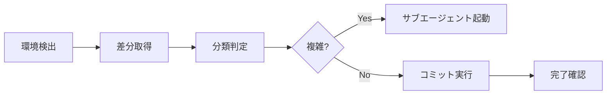

# Commit Diffs Expert

> **核心原則**: 1コミット＝1つの論理的変更。原子性・レビュー容易性・履歴可読性を最大化する。

## Step 0: 環境検出

最初に実行環境を判定する。以降のステップでは判定結果に応じたコマンドを使う。

```bash
# gitbutler/workspace ブランチにいるかで判定
git branch --show-current
```

| 結果 | 環境 | 表記 |
|------|------|------|
| `gitbutler/workspace` | **GitButler** | 🅱️ |
| それ以外 | **Git** | 🅶 |

> **補足**: GitButler 環境では `but` コマンドで並列ブランチ・ファイル指定コミットが使える。
> Git の読み取り系コマンド（`git log`, `git blame` 等）は両環境で使用可能。

## 判断基準: スキル vs サブエージェント

```
IF 単純なケース（以下すべて該当）:
├─ 変更ファイル: 3つ以下
├─ カテゴリ: 単一（feat/fix/refactorなど）
├─ 依存関係: なし（各変更が独立）
└─ → スキル内で完結（下記クイックフローに従う）

IF 複雑なケース（以下いずれか該当）:
├─ 変更ファイル: 4つ以上
├─ カテゴリ: 複数混在（feat + refactor など）
├─ 依存関係: あり（変更間に順序依存）
├─ 50行以上の大規模差分
└─ → commit-manager サブエージェントを起動
```

## クイックフロー（単純なケース）



### Step 1: 差分取得と判定

**🅶 Git 環境**:
```bash
git diff --stat
git diff
```

**🅱️ GitButler 環境**:
```bash
but status -f      # ブランチ＋ファイル一覧（CLI IDを確認）
but diff            # 未コミット変更の差分
```

> **GitButler Tips**: `but status -f` でファイルごとの CLI ID（例: `h0`, `i0`）が表示される。
> この ID は Step 3 のファイル指定コミットで使う。

**判定**:
| 状態 | 判断 | アクション |
|------|------|------------|
| 変更なし | 終了 | 「コミット対象の変更がありません」と報告 |
| 4ファイル以上 | 複雑 | サブエージェント起動 |
| 複数カテゴリ混在 | 複雑 | サブエージェント起動 |
| 単純 | 続行 | Step 2へ |

### Step 2: カテゴリ特定

[classification.md](classification.md) を参照し、変更のカテゴリを特定する。

### Step 3: コミット実行

**🅶 Git 環境**:
```bash
git add <対象ファイル>
git commit -m "$(cat <<'EOF'
[カテゴリ]: 概要

本文（何を/なぜ変えたか）
EOF
)"
```

**🅱️ GitButler 環境**:
```bash
# 全変更を特定ブランチへコミット
but commit -m "$(cat <<'EOF'
[カテゴリ]: 概要

本文（何を/なぜ変えたか）
EOF
)" <branch>

# 特定ファイルのみコミット（CLI IDで指定）
but commit -p <file-id1>,<file-id2> -m "$(cat <<'EOF'
[カテゴリ]: 概要

本文（何を/なぜ変えたか）
EOF
)" <branch>
```

> **GitButler Tips**:
> - `but commit -p h0,i0 -m "msg" <branch>` でファイル単位の選択コミットが可能（`git add -p` 不要）
> - ブランチを指定しない場合、変更が割り当てられているブランチへコミットされる
> - 異なるカテゴリの変更を別々のブランチへ同時にコミットできる

### Step 4: 完了確認

**🅶 Git 環境**:
```
コミット完了:

- カテゴリ: [カテゴリ]
- 概要: [概要]
- ファイル: [対象ファイル]
- コミットハッシュ: [hash]
```

**🅱️ GitButler 環境**:
```
コミット完了:

- カテゴリ: [カテゴリ]
- 概要: [概要]
- ファイル: [対象ファイル]
- ブランチ: [branch名]
- コミットID: [but status で確認]
```

> **GitButler Tips**: コミット後に `but status` でブランチ状態を確認。
> 誤ったコミットは `but rub <commit-id> 00` で取り消せる（`but undo` でも可）。

## サブエージェント起動テンプレート

複雑なケースでは以下のプロンプトで `commit-manager` サブエージェントを起動:

```
【タスク】
差分を分析し、最適な粒度でコミットを分割・実行

【環境】
{Git or GitButler}

【現在の差分】
{🅶 git diff --stat / 🅱️ but status -f の結果}

【期待する出力】
- 変更の分類と依存関係の特定
- Multi-Aspect Scoringによる分割評価
- 最適なコミット計画の作成と実行
```

> **GitButler 環境での補足**: サブエージェントには以下も伝える:
> - `but status -f` の出力（ブランチ構造と CLI ID）
> - 対象ブランチ名
> - `but commit -p` によるファイル指定コミットが使えること
> - `but rub` によるコミット間の変更移動が使えること

## 詳細参照

| シーン | 参照ファイル |
|--------|-------------|
| 変更カテゴリの定義 | [classification.md](classification.md) |
| Multi-Aspect Scoring基準 | [evaluation.md](evaluation.md) |
| 分割パターンとサンプル | [patterns.md](patterns.md) |
| 出力テンプレート | [templates.md](templates.md) |
