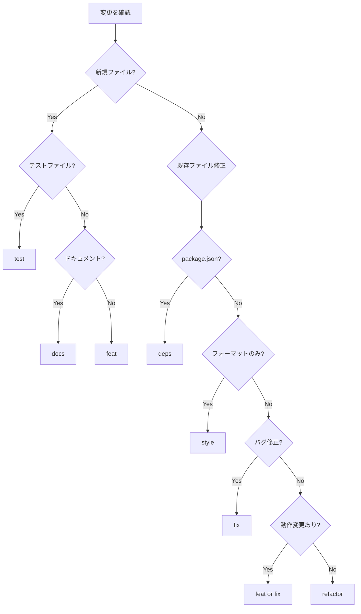

# 変更分類ガイド

> **目的**: 各変更を適切なカテゴリに分類し、コミットの粒度を最適化する

## カテゴリ定義

| カテゴリ | 説明 | 例 | 識別パターン |
|---------|------|-----|-------------|
| **feat** | 新機能の追加 | 新しいAPI、UI機能 | 新規ファイル作成、export追加 |
| **fix** | バグ修正 | 既存の動作の修正 | 条件分岐の修正、エラーハンドリング追加 |
| **refactor** | 振る舞いを変えないコード改善 | 関数の分割、命名変更 | テスト結果が変わらない構造変更 |
| **style** | フォーマット変更のみ | Prettier適用、空白調整 | インデント、改行、セミコロン |
| **deps** | 依存関係の更新 | package.json変更 | lockfile変更、バージョン更新 |
| **docs** | ドキュメント変更 | README、コメント | .md, JSDoc, コメント |
| **test** | テストコードの変更 | テスト追加・修正 | .test.ts, .spec.ts |
| **chore** | その他の雑務 | 設定ファイル、CI | .config.*, CI/CD設定 |

## 分類の判断フロー



## 依存関係の特定

変更間の依存関係を分析し、以下を特定する:

### 依存関係タイプ

| タイプ | 説明 | 判断基準 |
|--------|------|----------|
| **独立** | 他の変更なしで単独でコミット可能 | import/exportの変更がない |
| **依存** | 他の変更が先にコミットされている必要 | 型定義→使用箇所 の順序 |
| **関連** | 同じ論理単位として一緒にコミットすべき | 同一機能の実装とテスト |

### 依存関係の検出方法

**🅶 Git 環境**:
```bash
# import/exportの変更を確認
git diff | grep -E '^[+-].*(import|export)'

# 型定義の変更を確認
git diff | grep -E '^[+-].*(type|interface)'
```

**🅱️ GitButler 環境**:
```bash
# import/exportの変更を確認
but diff | grep -E '^[+-].*(import|export)'

# 型定義の変更を確認
but diff | grep -E '^[+-].*(type|interface)'

# ブランチごとの変更範囲を確認（どのブランチにどの変更が割り当てられているか）
but status -f
```

> **GitButler Tips**: `but status -f` でファイルがどのブランチに割り当てられているか確認できる。
> 依存関係のある変更が別ブランチに分かれている場合、`but rub <file-id> <branch-id>` で
> 同じブランチに集約するか、スタックブランチとして依存順序を明示する。

**判断基準**:
- 型定義を追加 → その型を使用する変更より先にコミット
- 共通関数を追加 → その関数を呼び出す変更より先にコミット
- テストと実装 → 同時コミット可（TDD的に1コミット）

## 混在パターンへの対処

複数カテゴリが混在する場合の分割優先順位:

```
1. style（フォーマット）を先に分離
2. refactor（リファクタ）を分離
3. deps（依存更新）を分離
4. feat/fix を最後に
```

**理由**: 
- フォーマット変更は差分ノイズを生む → 先に処理して本質的変更を明確化
- リファクタは振る舞い不変 → 機能追加前に基盤を整える
