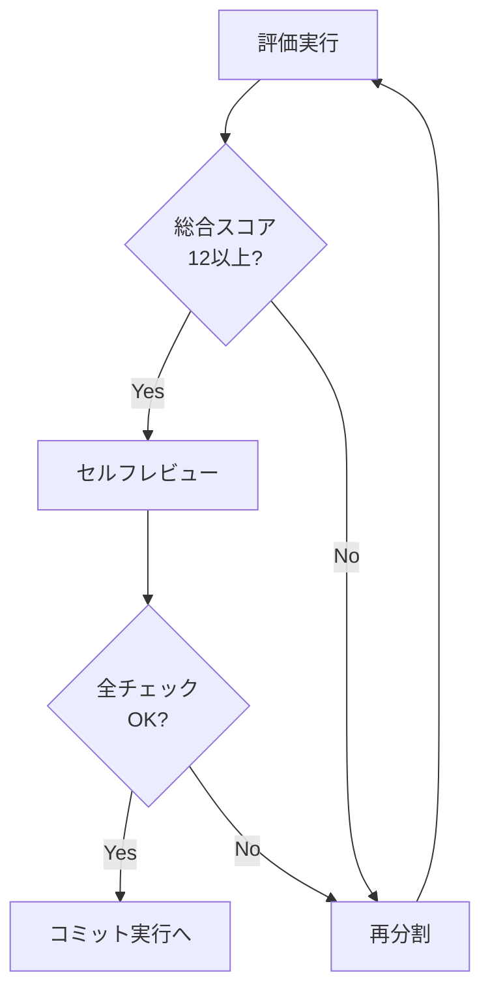

# Multi-Aspect Scoring 評価基準

> **目的**: コミット分割の妥当性を定量的に評価し、最適な粒度を決定する

## 評価軸（3つの観点）

各コミット候補を以下の**3つの観点**から評価する（各1-5点、合計3-15点）:

| 観点 | 評価基準 | 高スコア（5点） | 低スコア（1点） |
|------|----------|----------------|----------------|
| **原子性** | 1コミット＝1つの論理的変更か | 単一の目的、巻き戻し容易 | 複数の無関係な変更が混在 |
| **レビュー容易性** | レビュアーが理解しやすいか | 差分が小さく、意図が明確 | 差分が大きく、意図が不明瞭 |
| **履歴可読性** | 将来の履歴確認で有用か | 何をなぜ変えたか明確 | 曖昧なメッセージ、追跡困難 |

## スコア判定基準

### 原子性（Atomicity）

| スコア | 基準 |
|--------|------|
| 5 | 単一の目的、単一のカテゴリ、git revertで完全に巻き戻し可能 |
| 4 | 単一の目的だが、関連する複数の変更を含む |
| 3 | 目的は明確だが、付随的な変更（フォーマット等）が混在 |
| 2 | 複数の目的が混在するが、関連性はある |
| 1 | 無関係な変更が混在、巻き戻し時に副作用あり |

### レビュー容易性（Reviewability）

| スコア | 基準 |
|--------|------|
| 5 | 差分20行以内、変更意図が一目瞭然 |
| 4 | 差分50行以内、コンテキストを読めば理解可能 |
| 3 | 差分100行以内、説明があれば理解可能 |
| 2 | 差分200行以内、複数回の確認が必要 |
| 1 | 差分200行超、理解に時間がかかる |

### 履歴可読性（History Readability）

| スコア | 基準 |
|--------|------|
| 5 | コミットメッセージだけで何をなぜ変えたか分かる |
| 4 | コミットメッセージとdiffで理解可能 |
| 3 | 関連issueやPRを参照すれば理解可能 |
| 2 | コードを読み込む必要がある |
| 1 | 変更理由が不明、追跡困難 |

## 評価の実行フォーマット

```markdown
### コミット候補 N: [カテゴリ] 概要

**評価**:
- 原子性: [1-5]/5
  - 理由: [具体的な理由]
- レビュー容易性: [1-5]/5
  - 理由: [具体的な理由]
- 履歴可読性: [1-5]/5
  - 理由: [具体的な理由]
- **総合: [3-15]/15** → [合格/再分割検討]
```

## 合格基準

```
IF 総合スコア >= 12:
    → 合格、コミット実行へ

IF 総合スコア >= 9 AND 総合スコア < 12:
    → 条件付き合格、改善点を明記して実行

IF 総合スコア < 9:
    → 不合格、再分割を検討
```

## Self-Refine（自己改善ループ）

評価後、以下のセルフレビューを実施:

### チェックリスト

```
□ 各コミットは単独でビルド可能か？
□ 各コミットは単独でテストが通るか？
□ 無関係な変更が同じコミットに混在していないか？
□ 依存関係の順序は正しいか？
□ コミットメッセージは「何を／なぜ」を説明しているか？
```

### 改善フロー



## 評価の具体例

### 良い例（スコア 14/15）

```markdown
### コミット候補 1: [refactor] ユーザー取得ロジックを共通化

**評価**:
- 原子性: 5/5
  - 理由: 単一目的（共通化）、2ファイルのみ変更
- レビュー容易性: 4/5
  - 理由: 差分35行、意図明確
- 履歴可読性: 5/5
  - 理由: 「共通化」が明確、なぜ→DRY原則
- **総合: 14/15** → 合格 ✅
```

### 悪い例（スコア 7/15）

```markdown
### コミット候補 1: 変更

**評価**:
- 原子性: 2/5
  - 理由: feat + style + fix が混在
- レビュー容易性: 2/5
  - 理由: 差分180行、何が本質的変更か不明
- 履歴可読性: 3/5
  - 理由: 「変更」では何をなぜ変えたか不明
- **総合: 7/15** → 不合格 ❌ → 再分割
```
