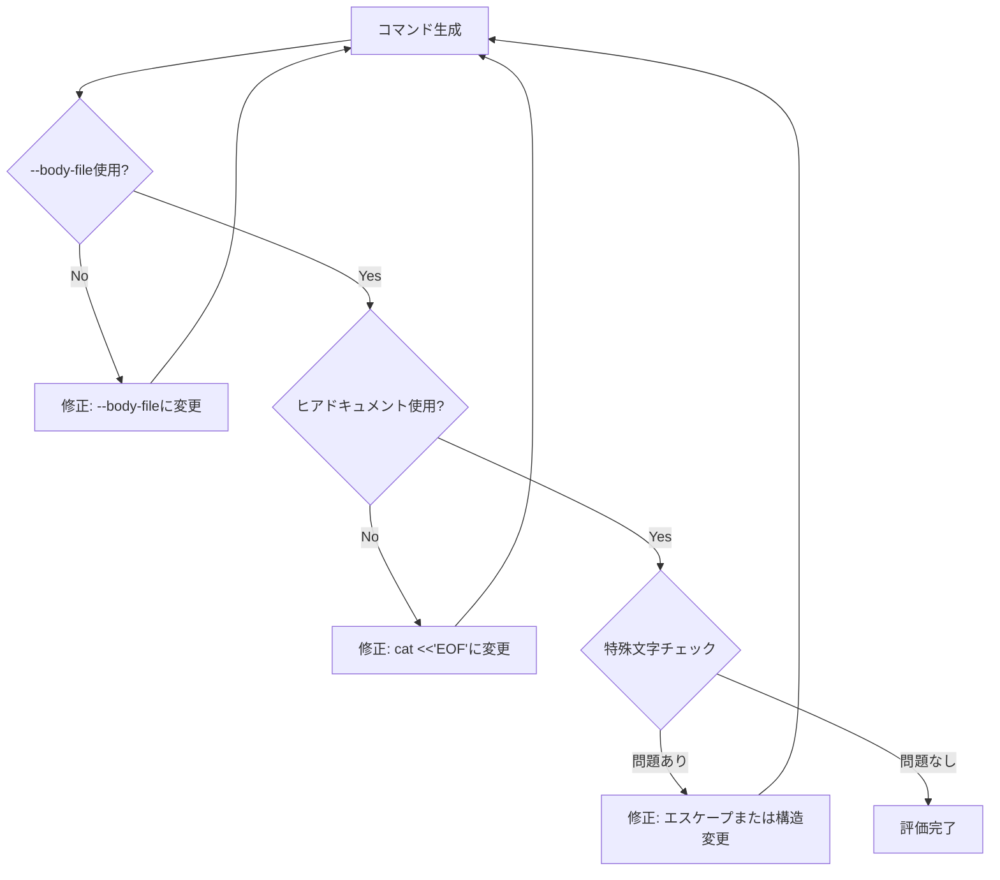

# 安全基準（Self-Refine）

> **目的**: `gh pr create` コマンドを実行する**前に**、シェルのクォーティング問題を防ぐ

## 評価チェックリスト

| 観点 | チェック項目 | NG例 | OK例 |
|------|-------------|------|------|
| **クォーティング** | `--body-file` を使用しているか？ | `--body "複数行..."` | `cat <<'EOF' \| gh pr create --body-file -` |
| **特殊文字** | `$`, `` ` ``, `"`, `'` が問題なく渡るか？ | `--body "変数は$count"` | `--body-file` なら安全 |
| **コードブロック** | Markdown内のコードブロックが壊れないか？ | 通常クォートで囲む | `<<'EOF'` でリテラル化 |
| **改行** | 意図した改行が保持されるか？ | `--body "line1\nline2"` | ヒアドキュメントで自然な改行 |

## 推奨パターン: --body-file + ヒアドキュメント

```bash
cat <<'EOF' | gh pr create \
  --draft \
  --base <ベースブランチ> \
  --assignee @me \
  --title "<タイトル>" \
  --body-file -
## なぜこの変更が必要か（背景）
...

## 変更内容
...
EOF
```

> **`--body-file -`** は標準入力から本文を読み取る。ヒアドキュメント `<<'EOF'`（シングルクォート付き）と組み合わせることで、**シェルのクォーティング問題を根本的に回避**できる。

## Self-Refine プロセス



### 評価結果の表示形式

```
## Self-Refine 評価結果

| 観点 | 結果 |
|------|------|
| --body-file使用 | OK |
| ヒアドキュメント | OK |
| 特殊文字 | OK |
| 改行 | OK |

→ 評価完了。実行に進みます。
```

## エラー時の対応

| エラー | 原因 | 対処 |
|--------|------|------|
| `not logged in` | gh未認証 | `gh auth login` を実行するよう案内 |
| `no commits between` | 差分なし | ベースブランチを確認、またはコミットを追加 |
| `already exists` | PR既存 | 既存PRのURLを表示して終了 |
| `repository not found` | リポジトリ設定不正 | `gh repo set-default` を実行するよう案内 |
| `branch not found` | 未push | `git push -u origin <branch>` を実行 |

## アンチパターン（避けるべき）

### NG: --body で直接指定

```bash
# 危険: 特殊文字が展開される可能性
gh pr create --body "## 概要
変数は $count です
コードは \`echo hello\` です"
```

### NG: ダブルクォートのヒアドキュメント

```bash
# 危険: 変数展開が発生する
cat <<EOF | gh pr create --body-file -
変数は $count です
EOF
```

### OK: シングルクォートのヒアドキュメント

```bash
# 安全: リテラル文字列として扱われる
cat <<'EOF' | gh pr create --body-file -
変数は $count です
コードは `echo hello` です
EOF
```
