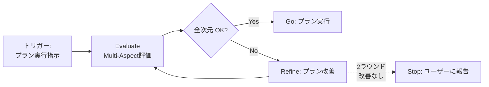

# Self-Refine

> 同じモデルが Generator → Evaluator → Refiner のサイクルを回し、
> 明示的な停止基準を満たすまで反復的に改善する。

## ワークフロー



## プロトコル

### Step 1: Evaluate（Multi-Aspect評価）

実行対象のプランを以下の **5次元** で評価する。
各次元の詳細定義は [reference/dimensions.md](reference/dimensions.md) を参照。

| # | 次元 | 問い | 判定 |
|---|------|------|------|
| 1 | **目的整合性** | このプランでユーザーの課題が解決するか？ | OK / NG |
| 2 | **影響範囲** | 見落としている影響範囲はないか？ | OK / NG |
| 3 | **前提妥当性** | 依拠している前提は正しいか？ | OK / NG |
| 4 | **実行可能性** | 具体的に実行できる粒度か？手順に曖昧さはないか？ | OK / NG |
| 5 | **認知負荷** | より単純な方法はないか？不要な複雑さを持ち込んでいないか？ | OK / NG |

### Step 2: 判定

```
IF 全次元 OK:
  → プランを実行する（Step 4へ）

IF いずれか NG:
  → NG次元ごとにフィードバックを言語化する（Step 3へ）

IF 2ラウンド連続で同じ次元が NG:
  → 自力改善の限界と判断し、ユーザーに報告する
```

### Step 3: Refine（プラン改善）

NG次元のフィードバックをもとにプランを改善する。

**Reflexion原則**: 前ラウンドの学びを1行に要約し、次ラウンドの評価に渡す。

```
前ラウンドの学び: [NG次元の要約と改善ポイント]
```

改善後、Step 1 に戻って再評価する。

### Step 4: Go（プラン実行）

全次元OKを確認したプランを実行する。

## 出力テンプレート

```markdown
## Self-Refine 結果

### Round [N]

| 次元 | 判定 | フィードバック |
|------|------|---------------|
| 目的整合性 | [OK/NG] | [フィードバック or "-"] |
| 影響範囲 | [OK/NG] | [フィードバック or "-"] |
| 前提妥当性 | [OK/NG] | [フィードバック or "-"] |
| 実行可能性 | [OK/NG] | [フィードバック or "-"] |
| 認知負荷 | [OK/NG] | [フィードバック or "-"] |

### 結論
- 判定: [Go / Refine / Stop]
- 前ラウンドの学び: [あれば]
```

## 停止基準

| 条件 | アクション |
|------|-----------|
| 全5次元 OK | プラン実行に進む |
| 2ラウンド連続で同じ次元が NG | ユーザーに報告し判断を仰ぐ |
| 最大3ラウンド到達 | 現時点のベストでユーザーに提示 |

## 併用パターン

| 状況 | 併用スキル | 使い方 |
|------|-----------|--------|
| 前提に自信がない | thinking-critical | 前提妥当性の検証を深掘り |
| 影響範囲が広い | thinking-mece | 漏れのない影響分析 |
| 問題設定自体を疑う | thinking-meta | メタレベルに上昇して再評価 |

## アンチパターン

| やりがち | 問題 | 対策 |
|---------|------|------|
| 全部OKにしてスキップ | リファインの意味がない | 最低1つは改善点を探す姿勢で臨む |
| 細部にこだわって無限ループ | 分析麻痺 | 最大3ラウンドで打ち切る |
| NGを出すが改善案がない | 前に進めない | NGには必ず改善案をセットで |
