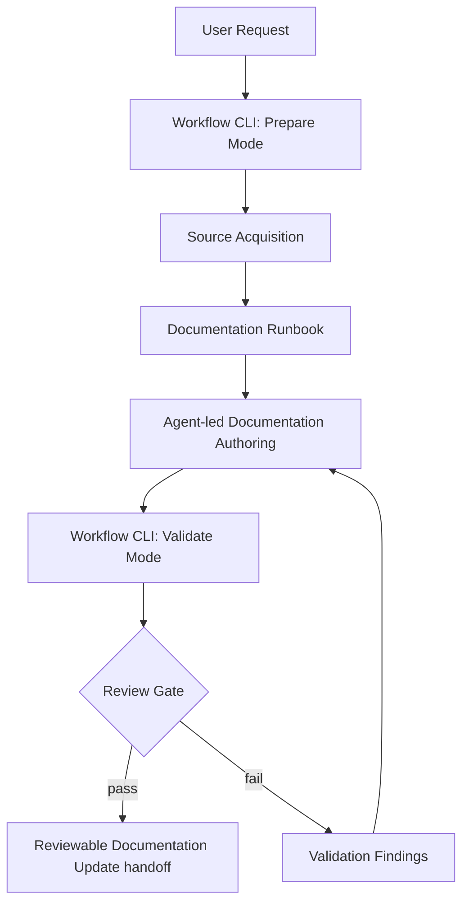
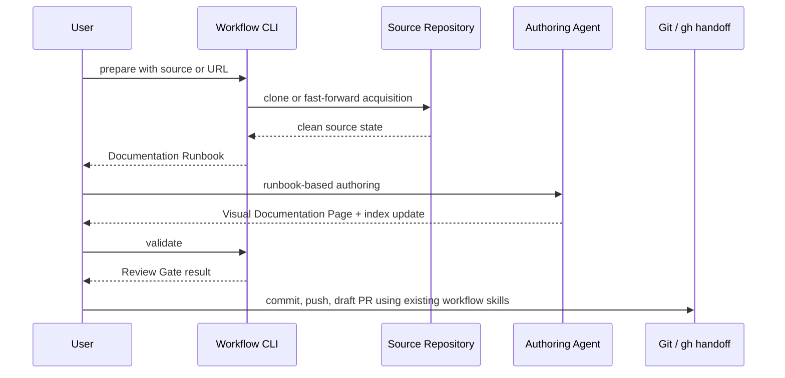

# Visual Documentation Workflow デザインドキュメント

## 1. 概要

任意の Source Repository から Visual Documentation Page を作成または更新し、Reviewable Documentation Update として draft PR へ渡すための Workflow CLI を導入する。

CLIはDocumentation Authoringを代替せず、Source Acquisition、Documentation Runbook生成、Review Gate検証を担う。

## 2. 背景と目標（WHY）

### 解決したい問題

Visual Documentation Page の作成は既存スキルで実行できるが、Source Repository の取得、命名候補、検証、レビュー引き渡しの手順が毎回人手依存になりやすい。

### 目標（GSMフレームワーク）

- **Goal**: Single Repository Workflow を、同じ手順と同じReview Gateで繰り返せるようにする。
- **Signal**: エージェントがDocumentation Runbookを読めば、対象、ページ状態、命名候補、検証条件を迷わず実行できる。
- **Metric**: `prepare` が1つのDocumentation Runbookを生成し、`validate` がReview Gateのpass/failとValidation Findingを返す。

## 3. 目標としないこと（Non-Goals）

- CLI内でHTML本文やビジュアル構成を生成しない。
- 初版では複数リポジトリの自動巡回や変更検出を行わない。
- 初版ではcommit、push、draft PR作成、Pages公開確認をCLI責務に含めない。
- Source Repository のdirty状態やfast-forward不可状態を自動修復しない。

## 4. 提案する設計（HOW）

### アーキテクチャ概要



### データモデル

- **Requested Documentation Run**: 1回の明示的な実行要求。
- **Source Repository**: Documentation Authoringの入力となるローカルのソース。
- **Source Inventory**: Documentation Authoring前に取得するsource構造と主要ファイルのscan結果。
- **Documentation Runbook**: 1回のRequested Documentation Runに対応するエージェント向け引き渡し文書。
- **Runbook Name**: doc slugから導出する実行補助runbookの名前。
- **Authoring Handoff**: Documentation Runbook内の中粒度プロンプト情報。source、ページ状態、命名候補、必読参照、Review Gate、PR前の注意を含む。
- **Naming Suggestion**: source名から導出したdoc名とbranch名の候補。
- **Naming Override**: source名が長い、または意味が曖昧なときにユーザーが明示するdoc名またはclone名。
- **Review Gate**: Reviewable Documentation Updateへ進む前の必須検証セット。
- **Review Scope**: Reviewable Documentation Updateまたはworkflow automation updateとして許容する差分範囲。
- **Validation Finding**: Review Gate失敗時に返す修正可能な指摘。

### API/インターフェース

Workflow CLI はTypeScriptで実装し、`tsx` で実行する。package script追加に依存せず、スクリプト先頭コメントに実行方法を記載する。

```text
npm run docs:prepare -- --source <source>
npm run docs:prepare -- --url <github-url> [--name <clone-name>]
npm run docs:validate -- --doc <docs-name>
```

`prepare` はSource Acquisitionと既存scan scriptによるSource Inventory取得を実行し、既存ページの有無、Naming Suggestion、Authoring Handoff、Review GateチェックリストをDocumentation Runbookへ出力する。

Documentation Runbookのファイル名は `<doc-slug>-runbook.md` とする。履歴保存ではなく実行補助なので、同じdoc slugの再実行では上書きを許容する。

`validate` はファイルを変更せず、Review Gateを評価してpass/failとValidation Findingを出力する。

`validate --doc` は `foo`、`foo.html`、`docs/foo.html` を受け取り、内部では `docs/foo.html` に正規化して扱う。

Naming Suggestionは4単語以内に収める。source名が5単語以上または意味が落ちる場合は、CLIが候補を提示しつつ、明示的なNaming Overrideで置き換えられるようにする。

### 処理フロー



### Review Gate

`validate` は最低限以下を確認する。

- Visual Documentation Page が存在する。
- indexにVisual Documentation Pageへのリンクが存在する。
- HTML headに `og:title` / `og:url` / `og:description` / `twitter:card` が存在する。
- 公開HTMLにローカル作業環境由来のパス表記が残っていない。
- Source Repository由来のファイルがレビュー対象に混入していない。
- 差分対象がReviewable Documentation Updateとして妥当な範囲に収まっている。

Review Scopeは以下を許容する。

- `docs/<name>.html`
- `index.html`
- `CONTEXT.md`
- `.gitignore`
- `docs/adr/*.md`
- `docs/design-docs/*.md`
- `scripts/*.ts`
- `package.json`
- `package-lock.json`
- `tsconfig.json`
- `vitest.config.ts`

## 5. 検討した代替案

| 案 | 概要 | 利点 | 欠点 | 採用しなかった理由 |
|----|------|------|------|-------------------|
| CLI完全生成 | CLIがソース解析からHTML生成まで担う | 人手が最小化される | LLM判断、文章品質、視覚構成をCLIに閉じ込める必要がある | Documentation Authoringは既存スキルとエージェント判断に任せる方が品質を保ちやすい |
| GitHub Actions化 | workflow_dispatchで取得からPR作成まで実行する | リモートで再現しやすい | authoring判断やレビュー前の対話が弱い | 初版ではローカルのagent-led authoringを中心にする |
| Agent-only運用 | 既存スキルだけで実行し続ける | 追加実装が少ない | 手順の揺れ、検証漏れ、命名揺れが残る | deterministicなWorkflow Coordinationが必要 |

## 6. 横断的関心事

### テスト戦略

CLIはNode.js標準APIでテスト可能な関数に分け、Vitestで実行する。`prepare` はsource正規化とrunbook生成を、`validate` はReview Gateごとのpass/failを個別にテストする。

```text
npm run test:workflow
```

### 監視・可観測性

各モードは成功時に実行結果の要約を、失敗時にValidation FindingまたはBlocked Source Repository理由を表示する。ログは人間とエージェントが次の行動を決められる粒度にする。

### セキュリティ・プライバシー

公開HTMLにローカル環境パスや作業用ソースパスを残さない。Source Acquisitionはdirty状態やfast-forward不可状態を自動修復せず停止する。

### 移行・廃止計画

既存のdocs-site visual documentation skillを置き換えず、その前後にWorkflow CLIを配置する。将来batch workflowやqueue workflowが必要になった場合も、Single Repository Workflowを基本単位として拡張する。

## 7. 未解決の質問

現時点ではなし。CLI実装はこのDesign Docを起点に開始した。

## 8. 参考資料

- `CONTEXT.md`
- `docs/adr/0001-workflow-cli-coordinates.md`
- `.cursor/skills/docs-site-add-visual-doc/SKILL.md`

---

## 更新履歴

| 日付 | 変更内容 | 理由 |
|------|----------|------|
| 2026-05-01 | 初版作成 | Workflow CLIの責務と初版スコープを固定するため |
| 2026-05-01 | CLI実装開始を反映 | 未解決質問を閉じるため |
| 2026-05-01 | TypeScript実行方針を反映 | `tsx`でWorkflow CLIを実行するため |
| 2026-05-01 | Vitest実行方針を反映 | テストランナーを統一するため |
